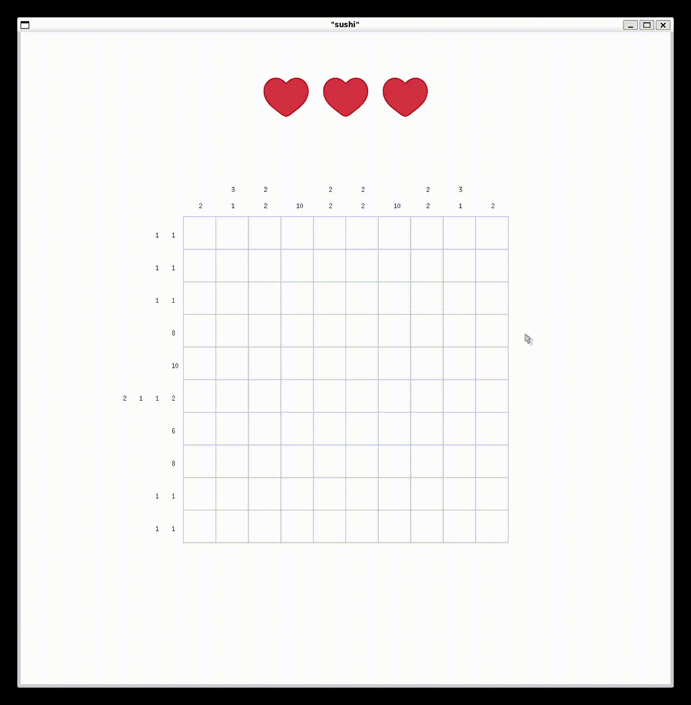

# | Nonogram | Lab 4 | P3309 | Тупиченко Мила |

## Цель
Написать японский кроссворд Nonogram на языке программирования OCaml.

## Задачи
1. Разобраться с библиотекой Graphics.
2. Написать минимальное поле для игры.
3. Реализовать функционал заграсски клеток.
4. Реализовать парсер данных для загрузки картинок.
5. Реализовать парсер данных для загрузки и раскраски уровней
6. Реализовать игровой функционал
7. Добавить два уровня игры

## Основной функционал

### Структуры данных
```OCaml
type cell = Filled | Empty | Unknown

type board = cell list list

type lvl = {
  lvl_name : string;
  board_size : int;
  board : cell list list;
  rows : int list list;
  cols : int list list;
  colors : (int * int * int) list list;
}
```
**cell** - тип клетки на поле. Может быть закрашена, пустая или неизвестная.

**board** - тип поля. Список строк клеток.

**lvl** - тип уровня. Содержит название уровня, размер поля, само поле, строки и столбцы с числами и цвета для закрашенных клеток.

### Функции
```OCaml
let draw_cell x y cell size =
  let x, y = calculate_cell_coordinates x y size in
  match cell with
  | Filled ->
      set_color (rgb 39 44 60);
      fill_rect x y cell_size cell_size
  | Empty ->
      set_color white;
      fill_rect x y cell_size cell_size;
      draw_image
        (scale_image (load_ppm "graphic/cross.ppm") cell_size cell_size)
        x y
  | Unknown ->
      set_color white;
      fill_rect x y cell_size cell_size

let draw_board board =
  let size = List.length board in
  for i = 0 to size - 1 do
    for j = 0 to size - 1 do
      draw_cell j i (List.nth (List.nth board i) j) size
    done
  done
```

**draw_cell** - основная функция закраски клеток

**draw_board** - функция отрисовки всего поля

```OCaml
let print_numbers rows cols =
  let size = List.length rows in
  let offset_x, offset_y = count_offsets size cell_size in
  let rec print_row_numbers row row_index i =
    match row with
    | [] -> ()
    | x :: xs ->
        moveto
          (offset_x - (cell_size / 2 * i) - 20)
          (offset_y + ((cell_size * row_index) + 20));
        set_color (rgb 39 44 60);
        draw_string (string_of_int x);
        print_row_numbers xs row_index (i + 1)
  in
  let rec print_col_numbers col col_index i =
    let col_size = List.length col in
    match col with
    | [] -> ()
    | x :: xs ->
        moveto
          (offset_x + (cell_size * col_index) + 30)
          (offset_y + (size * cell_size) + (cell_size / 2 * col_size) - 16);
        set_color (rgb 39 44 60);
        draw_string (string_of_int x);
        print_col_numbers xs col_index (i + 1)
  in
  for i = 0 to size - 1 do
    print_row_numbers (List.nth rows i) i 0;
    print_col_numbers (List.nth cols i) i 0
  done
```

**print_numbers** - функция по заданному из файла полю высчитывает количество клеток в столбцах и строках, которые должны быть закрашены, и выводит их в необходимом порядке на экран


```OCaml
let draw_hearts board =
  let heart = scale_image (load_ppm "graphic/heart.ppm") 100 100 in
  let x, y = count_heart_offsets (List.length board) in

  let rec aux x y = function
    | 0 -> ()
    | n ->
        draw_image heart x y;
        aux (x + 110) y (n - 1)
  in
  aux x y 3

let dec_heart board available_hearts =
  let heart = scale_image (load_ppm "graphic/grey_heart.ppm") 100 100 in
  let x, y = count_heart_offsets (List.length board) in
  draw_image heart (x + (110 * available_hearts)) y
```

**draw_hearts** - функция отрисовки оставшихся жизней

**dec_heart** - функция уменьшения количества жизней и перерисовки сердца, если игрок ошибся

```OCaml
let print_cross j i size board lvl_board =
  let cell = List.nth (List.nth lvl_board i) j in
  draw_cell j i cell size;
  draw_grid size;
  update_board board cell j i

let update_crosses game_board lvl get_cells check_filling swap_coords =
  let filled = check_filling game_board lvl in
  let size = List.length game_board in
  List.fold_left
    (fun acc_board (i, _) ->
      if check_requirements get_cells acc_board filled i then
        List.fold_left
          (fun acc_board (j, _) ->
            let x, y = swap_coords i j in
            print_cross x y size acc_board lvl.board)
          acc_board
          (List.mapi (fun j cell -> (j, cell)) (get_cells lvl.board i))
      else
        acc_board)
    game_board
    (List.mapi (fun i row -> (i, row)) lvl.board)

let print_row_crosses game_board lvl =
  update_crosses game_board lvl
    (fun board i -> List.nth board i)
    check_row_filling
    (fun i j -> (j, i))

let print_column_crosses game_board lvl =
  update_crosses game_board lvl
    (fun board i -> List.map (fun row -> List.nth row i) board)
    check_column_filling
    (fun i j -> (i, j))
```

**print_cross** - функция отрисовки крестика в клетке

**update_cross** - функция отрисовки крестиков в правильно заполненной строке или столбце: если игрок правильно заполнил все необходмые поля в строке или в столбце, то игра автоматически закрашивает крестиками пустые поля, чтобы игрок не путался

**print_row_crosses** - функция отрисовки крестиков в строках

**print_column_crosses** - функция отрисовки крестиков в столбцах

```OCaml
let handle_click game_board lvl lives =
  let solution_board = lvl.board in
  let status = wait_next_event [ Button_down ] in
  let offset_x, offset_y = count_offsets (List.length game_board) cell_size in
  let mx, my = (status.mouse_x, status.mouse_y) in

  match check_hitting mx my (List.length game_board) with
  | false -> (game_board, lives)
  | true -> (
      let x = (mx - offset_x) / cell_size in
      let y = (my - offset_y) / cell_size in
      let cell = find_cell x (List.nth game_board y) in

      match cell with
      | Unknown -> (
          let solution_cell = find_cell x (List.nth solution_board y) in
          match solution_cell with
          | Filled ->
              draw_cell x y Filled (List.length game_board);
              update_board game_board Filled x y
              |> fun board ->
              print_row_crosses board lvl
              |> fun board ->
              print_column_crosses board lvl
              |> fun board ->
              draw_grid (List.length board);
              (board, lives)
          | Empty ->
              draw_cell x y Empty (List.length game_board);
              draw_grid (List.length game_board);
              dec_heart game_board (lives - 1);
              (update_board game_board Empty x y, lives - 1)
          | Unknown -> (game_board, lives))
      | _ -> (game_board, lives))
```

**handle_click** - функция обработки клика мыши. Если игрок попал в клетку, то клетка закрашивается, и проверяется, правильно ли игрок закрасил клетку. Если игрок ошибся, то у него уменьшается количество жизней

```OCaml
let colour_board lvl =
  let size = List.length lvl.board in
  List.iteri
    (fun i row ->
      List.iteri
        (fun j _ ->
          let x, y = calculate_cell_coordinates j i size in
          let r, g, b = List.nth (List.nth lvl.colors i) j in
          set_color (rgb r g b);
          fill_rect x y cell_size cell_size)
        row)
    lvl.board
```

**colour_board** - функция закрашивания клеток в соответствии с цветами из файла (вызывается после того, как игрок прошел уровень)

### Примеры выполнения 

#### Запуск игры


#### Поражение


#### Автоматическая закраска клеток


#### Пройденный уровень


